登录页

注册页

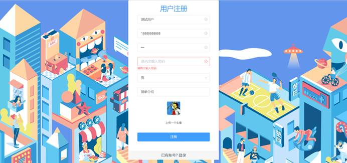

首页-推荐回答，可以根据热门问题标签进行分类筛选该标签下的回答

 

 

 

首页-热门文章，可以根据热门标签进行分类，筛选该标签下的文章

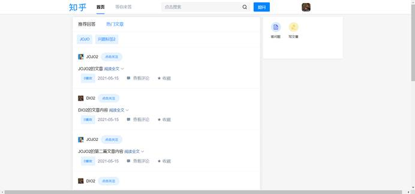

点击关注可以关注用户，如果已关注则会提示

点击查看评论弹出评论框，可查看和添加评论：

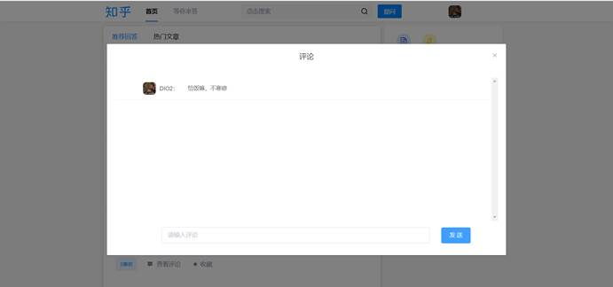

 

 

点击收藏按钮会收藏回答或者文章：

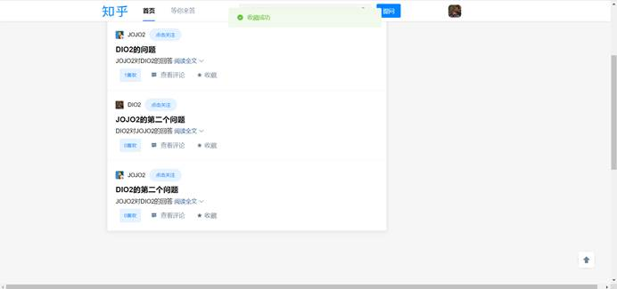

收藏的回答和文章可以点击头像->我的主页，在个人主页的收藏里看到：

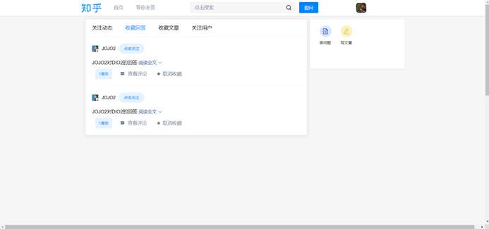

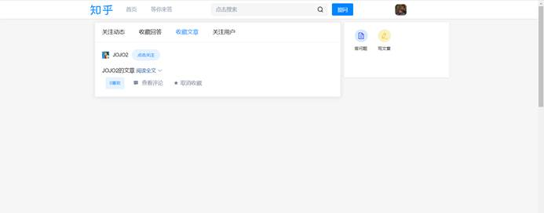

 

 

 

 

 

查看关注的用户，点击可以取关：

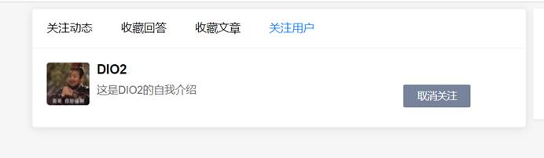

关注用户之后，在个人主页的关注动态里可以查看到自己关注的用户的点赞动态：

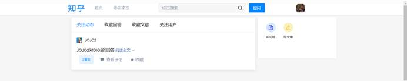

点击提问按钮进行提问：

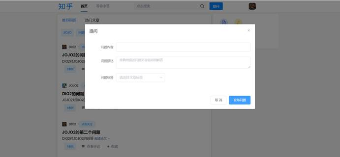

在等你来答页面中，点击写回答：

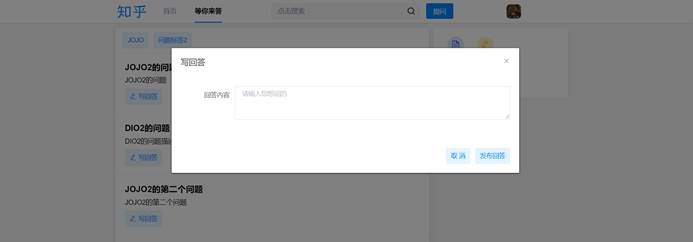

点击喜欢按钮点赞或取消点赞文章，按钮会显示该文章或回答总共的点赞数量：

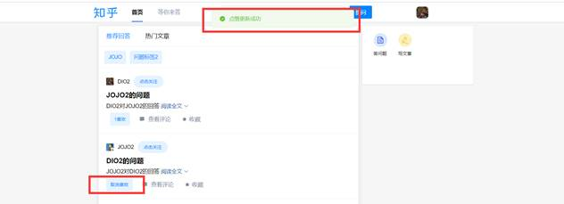

 

点击写文章按钮，跳转到写文章页面，可以写文章并发布：

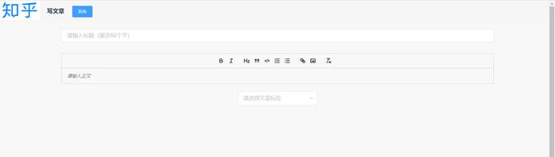